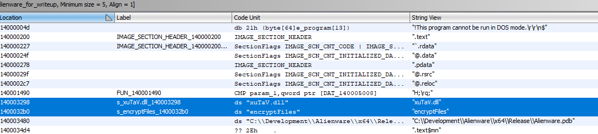
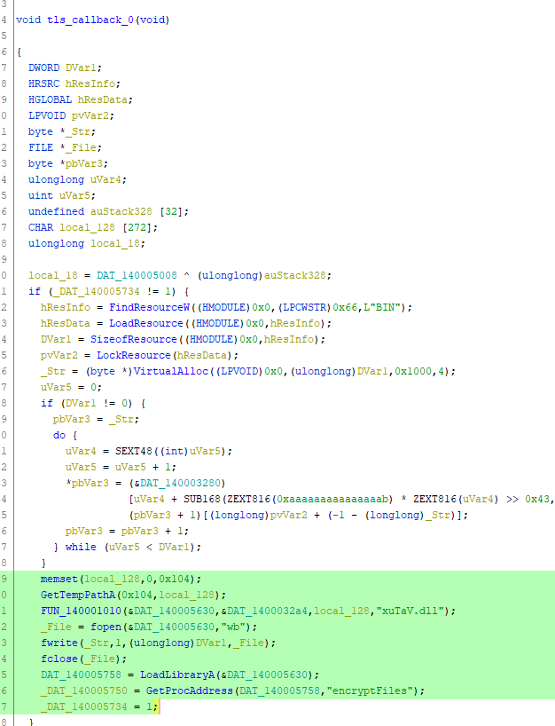
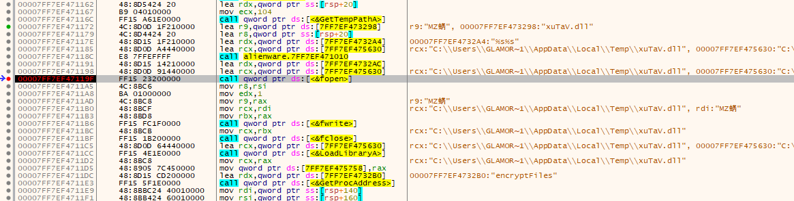
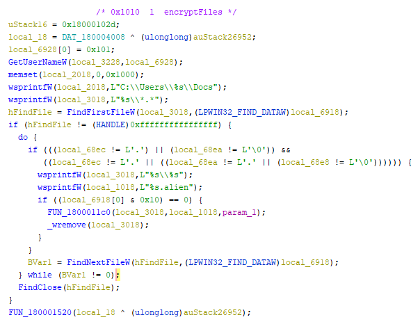
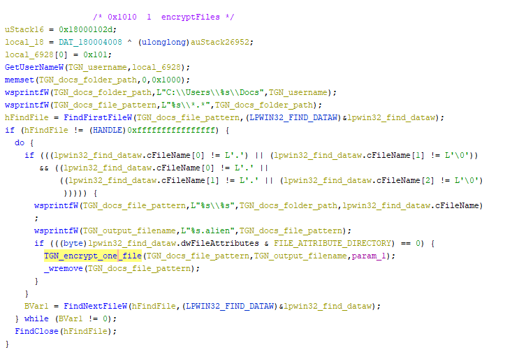
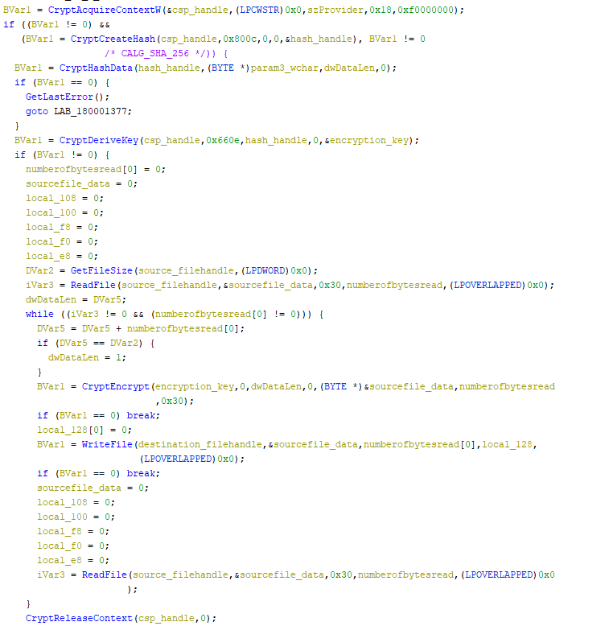
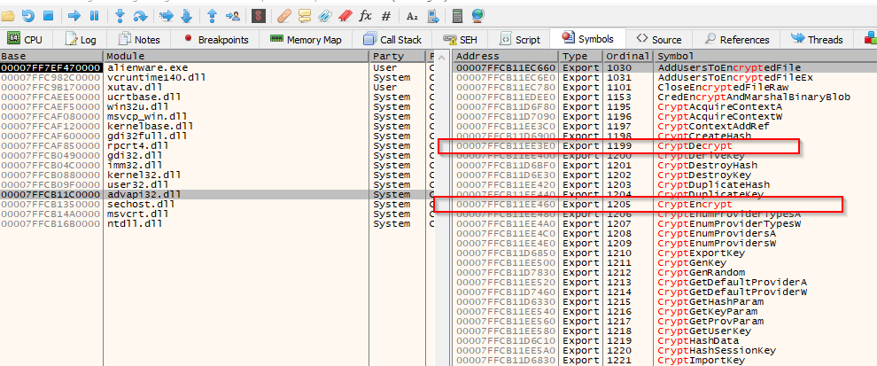
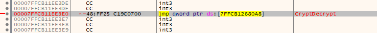
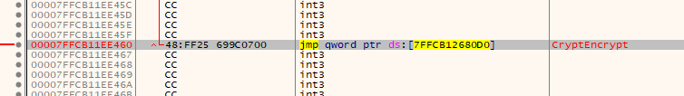
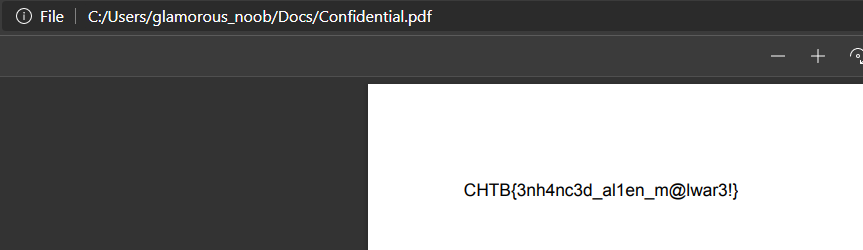

# Alienware Writeup

## Disclaimer

- If by any sad chance you have files in the specific folder where the executable in this challenge looks for file to encrypt, you might lose them if you're not careful
- The version of the solution presented here is not *really 100%* identical to what happened. In reality, my solution involved a lot of false leads, stupid decisions, and light crying. The version of the solution in this document is just more presentable and useful for you.
- I tried to make it in a way that you'd be able to reproduce the steps as you go along the way. The tools are used are Ghidra and x64dbg. Good luck and happy hacking! ♥

## Finding the first clue

> *We discovered this tool in the E.T. toolkit which they used to encrypt and exfiltrate files from infected systems. Can you help us recover the files?*

After reading this, we download a certain *Alienware.exe*, and what we assume to be an encrypted file that we want to recover called *Confidential.pdf.alien*.
Let us load the file in Ghidra, run the analysis, and search for strings!

There are not a lot of strings in this executable, but we can find 2 interesting ones:

Looking up `xuTaV.dll` on a search engine confirms it's not a known DLL file. And that string, `encryptFiles` is as reliable as leads can get. By following either one of the strings we arrive at the same place:

## Sneaky Aliens

So what do we learn? 

1. The executable uses `GetTempPathA` (to get a temp path, duh)
2. The pattern of execution following this hints at `xuTaV.dll` being concatenated to the temp path (wild educated guess)
3. The executable then writes something to this supposed DLL, loads it, and looks for its "encryptFiles" function to execute it
4. All of this sneakily happens in the "TLS callback" ([fast explanation](https://www.hex-rays.com/blog/tls-callbacks/))

It's safe to assume that this EXE has the DLL code stored in one way or another, it eventually gets written to the hard disk somewhere in a Temp folder, and *then* it's used to encrypt some files. At this point, I just switched gears to dynamic analysis using x64dbg.

Simply load `Alienware.exe` in x64dbg, click on "Execute till return" until you get out of `ntdll.dll` (you can know that from the window title after the word "Module"). Once you're in `Alienware.exe` module, the easiest way I know of for locating the code we want is looking for the strings used on it.

Right click in the CPU window → Current module → String references → Double click on `"encryptFiles"` when you find it, it will take you to the code we want in x64dbg (the one we just saw in Ghidra). Put a breakpoint at the `fopen` line and continue the execution.  You should see this in your window.

Thanks to this, we now know where the DLL ends up, so we can just click on "step over" until `fclose` is executed. Then, we can go copy the DLL from the temp directory to our working directory and import it in Ghidra where we'll be able to finally see the `encryptFiles` function.

Without getting into all of the details, we can already see some interesting calls: `GetUserNameW`, the `wsprintfW` ones and the strings they deal with, `FindFirstFileW`, and `FindNextFileW`. Since these are known functions, it allows us to quickly guess what's happening. But before that, a clean up is in order. Behold, the same function after renaming, retyping, and some function signature overriding:

I won't explain the details of this to avoid making a very long writeup, but you can email me if you have specific questions or something.
Of course `FUN_1800011c0` suddenly becoming `TGN_encrypt_one_file` is a bit of guessing. But given the context, it's fairly safe to assume that. Plus, when we open this function, we find a lot of the functions from the Windows API with "Crypt" in them. 

## The encryption procedure

I'll also skip the clean up part and show directly the renamed / retyped / overriden version of `TGN_encrypt_one_file`. Soooo, this is part is basically reading documentation. You can look the functions up and see what they do exactly, but here's the basic scheme is using some secret, deriving a hash from it, and deriving an encryption key from the hash. Then the algorithm uses that key to encrypt the file per chunks of 0x30 bytes.

**<u>Summary:</u>**  For every file in the `C:\Users\<username>\Docs\` folder, it is encrypted using Windows API, and the extension `.alien` is appended to the file name.

To confirm the theory, I created that "Docs" folder and created a text file in it with a simple sentence or a word. Then I ran the executable and it did as expected. It also deleted the old file. So it really acts a little bit like a crypto locker.

## The solution

**<u>SPOILER ALERT:</u>**  In this solution, I do not even try to figure out the secret, the hash, or the key. I do not try to code anything in C using the Windows API, or any of the limited python interfaces for that. I cheat the whole thing during runtime. Before divulging the trick, let's read this fabulous paragraph from [Windows documentation](https://docs.microsoft.com/en-us/windows/win32/api/wincrypt/nf-wincrypt-cryptderivekey):

> The CryptDeriveKey function generates cryptographic [session keys](https://docs.microsoft.com/en-us/windows/desktop/SecGloss/s-gly) derived from a base data value. This function guarantees that when the same [cryptographic service provider](https://docs.microsoft.com/en-us/windows/desktop/SecGloss/c-gly) (CSP) and algorithms are used, the keys generated from the same base data are identical. The base data can be a password or any other user data.

That's obvious, because of there wasn't this guarantee, then no one can actually use that API. But reading it makes you think, *"Can't I just somehow make the app generate its key as it always does, and fool it into decrypting the file instead of encrypting it ?"*. *Plus*, if we spend a little time figuring out the flags used and so on, we know it's an AES key, a symmetric scheme, where the encryption key is the same as the decryption key. And <u>*that's*</u> the angle that actually got me the flag.

Key information for understanding the solution:

- `CryptEncrypt`, which is part of the ADVAPI32.DLL's exports, has an equivalent function called `CryptDecrypt` in the same DLL.
- `CryptDecrypt` takes exactly the same arguments as `CryptEncrypt` minus the last one, in the same order.
- For dynamically-linked files (like the one we're dealing with), external functions (like the ones imported from ADVAPI32.DLL) have their references stored in "some symbolic way" (if you're interested, do some research on dynamic linking, plt/got in elf format, the IAT in PE format, etc.). During execution time, the linker does the work of transforming these references into real references in the imported DLLs

The solution itself:

1. Run the executable in x64dbg.
2. Put a breakpoint somewhere after `xuTaV.dll` is created and loaded.
3. Search for `CryptEncrypt` and `CryptDecrypt` in `ADVAPI32.DLL`, and make `CryptEncrypt` jump to `CryptDecrypt` in the very beginning of it.

## Demonstration

If it seems unclear in theory, let's practice it. Here, after `xutav.dll` and consequently `advapi32.dll` have been loaded, we can see the exports of `advapi32.dll`. We want to find `CryptEncrypt`and `CryptDecrypt`. 

Clicking on each of these entries will take us to a jump instruction that leads (eventually, indirectly) to the real function represented by that entry. So here's `CryptDecrypt`:

And here's `CryptEncrypt`:

Our hack is a simple as patching that second `jmp` instruction and make it go to `7FFCB12680A8` like the first `jmp`.

And there you go, just paste the *Confidential.pdf.alien* file in the folder where the weird DLL looks for files and it will be decrypted. Rename it to remove the `.alien.alien` at the end, and you get this:

Tadaaa.