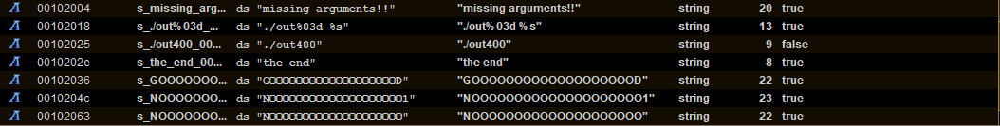
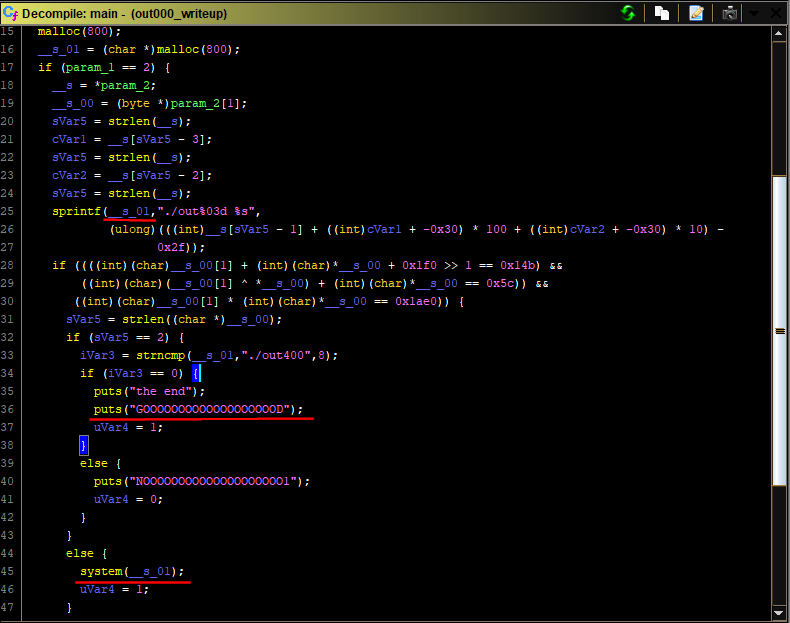
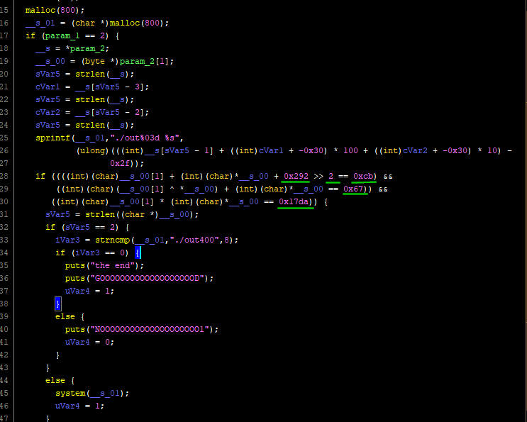
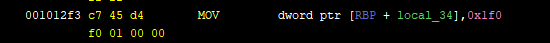
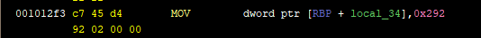
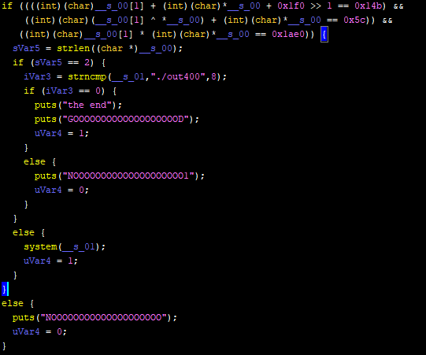
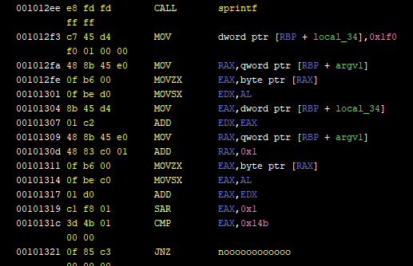
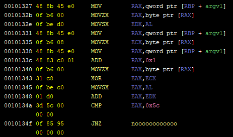
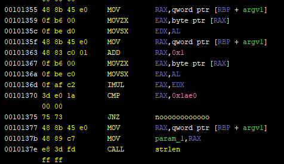
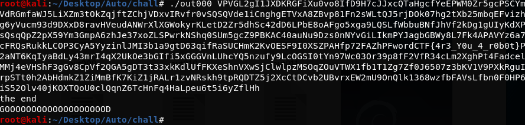

# Fword CTF 2020

## Auto

### Disclaimer

This is a write-up of how I, glamorous_noob of the team kawaii-hexabutts did this challenge. I am new to CTFs, so I don't have any guarantee about quality. It is possible that better and faster solutions or write-ups exist. That being said, I hope you find something useful in here.

Also, since this write-up aims at being as clear as possible, I will organize the walkthrough in a "more ideal" way compared to what happened in reality. Namely, I won't talk about the things I wasted time on, and will I appear more skillful than I really am. It's up to you to know that this is not true, and that I'm just an aspiring glamorous noob.

Have fun reading! (and, you know, happy hacking)

### First impression

This challenge is called  "Auto". When downloading the archive from the CTF platform you read something along the lines of "You might need a robot for this", and when you extract said archive, you find 400 files named `outxxx` where the `xxx` part is a number between `000` and `399` both included.

The challenge is SCREAMING automation, and that's a very useful piece of information to keep in mind as you'll see in the next sections. Knowing I'd have to automate something, my main focus was on similarities and differences between files.

### Getting the big picture

I started by importing the first two files, `out000` and `out001`, in my go-to tool for static analysis, Ghidra. Searching for strings seemed like a sensible first step, and here's what I found in `out000`:



Same strings were found in the other file.

Following the `"GOOOOOOOOOOOOOOOOOOOD"` string reference, we find that it's used in the main function. Although I usually prefer assembly if I'm looking to correctly understand the code (with some exceptions), I like the decompiler view in Ghidra and how it gives a general idea of the function's flow of execution. Here's how the main function looks like in `out000`, before any intervention from my part (focus on the parts I underlined/ framed):



Without diving in details, we can see some interesting stuff:

- `param_2[1]` in the `main` function is definitely a command line argument. `param_1` is definitely `argc`. This program takes one command line argument. That will be our input and that's what will control the program's behavior.
- Two outcomes in these if/else scenarios are interesting, the one where `"the end"` get printed, and the one where the `system` function gets executed.
- If the `system` function gets executed, it will do so with the string used as a destination for the `sprintf`call on line 25

Without getting lost in the details, let's look at `out001` and see how similar it is to `out000`! 



It's almost identical to `out000`'s main function, except for the 5 values I underlined. I suppose then that all 400 hundred files have exactly the same code, except for the 5 values that change every time, and that I would need to:

1. automatically extract these values from all files
2. do something with them

And that's pretty sufficient for a "big picture" view of this challenge.

### Extracting the values

A little pause from the analysis to see how one would go about extracting these values from the 400 files. My go-to language in these situations, like many other people, is python. My approach for the extraction was this:

1. Hardcode the offset for each needed value
2. Open every file, read it, get the values at the hardcoded offsets

First things first, I needed to make sure that the values existed at the same offsets across all files. Looking at these screenshots from `out000` and `out001` respectively, we can see that the first constant (`0x1f0` in `out000` and `0x292` in `out001`) has consistently the same virtual address `0x1012f3 + 3 = 0x1012f6` and is coded on 4 bytes in little endian.





The only thing missing is to know the real offset in the binary corresponding to this virtual address (the version of Ghidra I'm using doesn't keep that kind of information). For this I can think of two ways:

1. The less reliable way, is to make the educated guess that if the virtual address here in Ghidra is `0x1012f6`, the the offset is the least significant two bytes, `0x12f6`, without the added `0x100000`.
2. The more reliable way, is using objdump (it has to be a 64bit version of objdump) with the `-F` option. So it gives something like `objdump -dF out000 | less` and then you'll see the offsets.

Applying the previous logic to all 5 constants gives me all 5 offsets needed to make this piece of code

```python
def read_constants(filename):
    f = open(filename, 'rb')
    data = f.read(0x1380) # highest offset needed is 0x1371, so reading only 0x1380 is enough
    f.close()
    offset = 0x12f6 
    a = unpack('<L', data[offset:offset+4])[0] #interpreting the 4 bytes as a little endian integer
    offset = 0x131d
    b = unpack('<L', data[offset:offset+4])[0] # same
    offset = 0x134b
    c = unpack('<L', data[offset:offset+4])[0] # same
    offset = 0x1371
    d = unpack('<L', data[offset:offset+4])[0] # same
    shift = data[0x131b] # the value is coded on only one byte in the executable
    return a,b,c,d,shift
```

The superior reader might notice that `shift` exists at a smaller offset than `b`, `c` and `d` and yet it comes after them in my code. That's because I realized it varied from one file to another only half-way through after I'd already coded this function. Sue me.

### What to do with these values

Now that we can have our values whenever we want, comes the greater question: what to do with them?

Well, first of all, we know that they are used in some mad if statement leading to where we want to go. If the condition in that if statement evaluates to false, we will go to the `NOOOOOOOOOOOOOOOOOOOO` part. So now all we have to do is to understand the math in the if statement, and understand how our input to the program will affect it.



You *could* just try to figure it out from the decompiler's version, and maybe fight your way through retyping and renaming, but I think this is one of the cases where I prefer by far the assembly approach. Let's take it step by step:



Here's the assembly part showing what happens right after the `sprintf` call that we saw in the decompiler window. I went ahead and renamed some labels and stack variables like `argv1`. It can easily be done by checking the references of when the variable was used (especially when it was written to) and deducing what it contains. `local_34` is a default name. Same thing for the `noooooooooooo` label, I just followed it and saw it lead to printing the "No" string.

Anyway, here's some pseudo-code of what this assembly does:

```
put the byte argv1[0] in EDX   (instructions from 0x1012fa to 0x101301) 
Add 0x1f0 to it  (instructions 0x1012f3 & 0x101304 & 0x101307)
put the byte argv1[1] in EAX (instructions from 0x101309 to 0x101314)
Compute their sum
Shift the sum 0x1 to the right 
If the result is not 0x14b go to hell
```

Without forgetting that `0x1f0`, `0x1`, and `0x14b` change from one executable to another, let's write this in python.

```python
user_input="Something YADA YADA"
X = user_input[0]
Y = user_input[1]
a = 0x1f0
b = 0x1fb
shift = 1

if ((a+X+Y)>>shift)!=b:
	return False #yeah yeah illegal use of return statement but you get the gist
```

Okeey first formula that our input should validate has been found! Without forgetting, of course, that `a`, `b`, and `shift`vary across files, and that each file will have the same formula but different values for constants. How to actually craft input to satisfy the conditions will come later in this write-up.



Now for the second formula, I won't detail what instructions do as I did for the first one, but here's the pythonic translation:

```python
X = user_input[0]
Y = user_input[1]
c = 0x5c

if (X + (X ^ Y)) != c:
	return False #yeah yeah illegal use of return statement but you get the gist
```

And last but not least here's the third part of the if statement. Notice that if we survive the `JNZ` instruction, we will reach the the `strlen` statement that the decompiler shows *inside* the if block. We will get out of the if statement and finally get closer to our goal.



```python
X = user_input[0]
Y = user_input[1]
d = 0x1ae0

if X * Y != d:
	return False #yeah yeah illegal use of return statement but you get the gist
```

### Solving  for `X` and `Y`

To cut to the chase I'm going to show you my final python function for finding `X` and `Y`, and I will comment on the most important "gotchas" after.

```python
def find_bytes(a,b,c,d,shift):
    alphabet = printable[:-6] # all printable characters that are not white space
    min_sum = (b<<shift)-a # direct interpretation of the 1st formula ((a+X+Y)>>shift) == b
    max_sum_excluded = min_sum + 2**shift # Because information is lost after right shift. More on that later
    for s in range(min_sum, max_sum_excluded): # s represents X+Y
        for character in alphabet: # iterating over all possible values for X
            X = ord(character)
            Y = s - X
            if X + ( X ^ Y) == c: # do current values for X and Y validate the 2nd formula?
                print('Found candidates', X, '&', Y, 'for s =', s)
                if X * Y == d: # do current values for X and Y validate the 3rd formula?
                    print('--> Confirmed')
                    return chr(X)+chr(Y)
                else:
                    print('--> Impostors')
```

In this part I explain the main "gotcha" of this solution.

The original executable code applies the following operation (that I call the 1st formula) `(a+X+Y)>>shift==b`. While trying to isolate the unknown variables `X` and `Y` on one side and the known values `shift`, `a`  and  `b` on the other, I got this `X+Y == (b << shift) - a` thinking it was ok when it's not.

When the shift to the right is made, information is lost. Example `0xff >> 4` is `0xf`, and doing `0xf<<4` gives `0xf0`. See? A left shift doesn't automatically "reverse the effect" of a right shift. This loss of information should be taken into account. In order to do this, we could write it this way: `0xff == 0xf<<4 + k` where `k` is a constant. We can also reasonably say that `k` in this case is at max a 4-bit value (because the right shift operation removed information from 4 bits). These two lines of my python code, found in the solution above, are a generalisation of this idea.

```python
    min_sum = (b<<shift)-a 
    max_sum_excluded = min_sum + 2**shift 
```

Soooo we can not know the original sum, but we can get an interval of where it is.

You *could* in theory try to have a more mathematical approach and try to "solve equations" using the sum and the product and the mathematical discriminant and all that but honestly that's too complicated for something that can be solved with a <100 iterations loop.

### How it all fits together

So far we have been able to extract the values of the constants from the files, and now we know how to use these values to deduce how our input should be. Now we only need to know how it should all fit together. For that we'll return to the code in the first screenshot of this write-up:

 

After the if statement is validated, `strlen` calculates the size of our command line argument. If it's only two characters long, the first 8 characters of a certain string `__s_01` is compared `./out400`, and if it's equal to it we win. If it's not we lose.

If, on the other hand, our command line argument is not two characters long, the string `__s_01` is executed as a command by the function `system`. So we should look at how `__s_01` is constructed at the `sprintf` call before the if block.

The first thing that is clear though, it's that it's ugly. The other one, is that the decompiler got the number of arguments wrong. The string corresponding to the `"%s"` specifier is missing in the decompiler . I could try and make it clearer by retyping, renaming, and overriding signatures, but that's too much suffering because most of the variables here are register variables not stack variables, and Ghidra's decompiler has a painful way of handling that. Here again, I prefer going back to the assembly.

I won't go into the detail of the analysis of that part because it's not the most interesting part about this challenge. But here's the result of digging into the assembly interpreted in python:

```python
from sys import argv

binary_name = argv[0]
cmd_arg = argv[1]

n = int(binary_name[-3:]) +1
__s_01 = "./out"+str(n)+" "+cmd_arg[2:]
```

So basically, if the if statement is validated, the binary executes the one after it and passes to it the command line argument except the two first characters of it (since they were already examined by the current binary).

What all of this means is, that by executing  `./out000 ABCDEFGHIJKL`, if `AB` validate the formulas, `./out001 CDEFGHIJKL` will be called. If `CD` validate this second executable's formulas, `./out002 EFGHIJKL` will be called, and so on. This ends when we reach `./out399` validates its if statement.

### Demo

In addition to the previous python code, I'll add this:

```python

def generate_filenames():
    return ['out{:03d}'.format(i) for i in range(400)]

def find_answer():
    res=""
    filenames=generate_filenames()
    for name in filenames:
        a,b,c,d,shift = read_constants(name)
        res+=find_bytes(a,b,c,d,shift)
    return res
```

By running the function `find_answer()`, I generated the command line argument that I needed to provide to `out000`.

Here's what the command line argument looks like:

```
VPVGL2gI1JXDKRGFiXu0vo8IfD9H7cJJxcQTaHgcfYeEPWM0Zr5gcPSCYmVdRGmfaWJ5LiXZm3tOkZqjftZChjVDxvIRvfr0vSQSQVde1iCnghgETVxA8ZBvp81Fn2sWLtQJ5rjDOk07hg2tXb25mbqEFvizhg6yVucm93d9DXxD8ravHVeudANWrXlXGWokyrKLetD2Zr5dhSc42dD6LPbE8oAFgo5xga9LQSLfWbbuBNfJhVf2kDg1gUIyKdXPsQsqQpZ2pX59Ym3GmpA6zhJe37xoZLSPwrkNShq0SUm5gcZ9PBKAC40auNu9Dzs0nNYvGiLIkmPYJagbGBWy8L7Fk4APAVYz6a7cFRQsRukkLCOP3CyA5YyzinlJMI3b1a9gtD63qifRaSUCHmK2KvOESF9I0XSZPAHfp72FAZhPFwordCTF{4r3_Y0u_4_r0b0t}P2aNT6KqIyaBdLy43mrI4qX2UkOe3bGIfi5xGGGVnLUhcYQ5nzufy9LcOGSI0tYn97Wc03Or39p8fF2VfR34cLm2XghPt4FadcelMMj4eVHShF3gGv8CpVf2QGA5gDT3t33xkKdlUfFKXeShnVXwSjClwlpzMSOqZOuVTWX1fb1T1Zg7Zf0J6507z3bKV1V9PXkRguIrpSTt0h2AbHdmkZ1ZiMmBfK7KiZ1jRALr1zvNRskh9tpRQDTZ5j2XcCtDCvb2UBvrxEW2mU9OnQlk1368wzfbFAVsLfbn0F0HP6iS52Olv40jKOXTQoU0clQqnZ6TcHnFq4HaLpeu6t5i6yZflHh
```

You can notice that it contains the flag `FwordCTF{4r3_Y0u_4_r0b0t}`.

Here's a demo!



Thanks for reading!